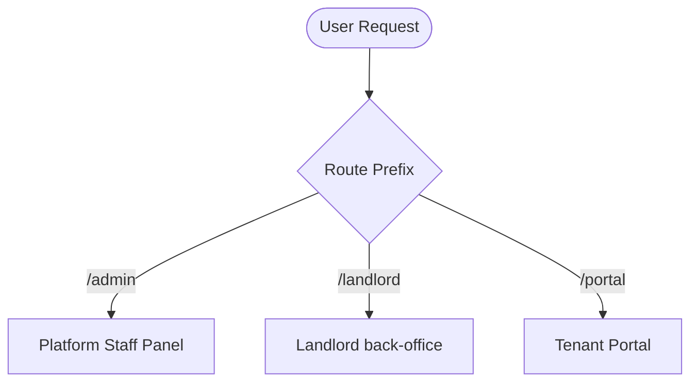

# 🏛️ System Architecture

RentWise is built using a **multi-panel structure** on Laravel and Filament v3. This design keeps user roles, access control, and dashboards strictly isolated.

---

## 🎛️ Panel Isolation

The application has three primary entry points:

### 1. Platform Staff Panel (`/admin`)
- **Controller/Provider**: `App\Providers\Filament\AdminPanelProvider`
- **Authorized Roles**: `super_admin`, `support`
- **Focus**: Global system administration (SaaS plans, landlord subscriptions, global user directory).
- **Core Resources**:
  - `SubscriptionPlanResource` ➔ SaaS package settings.
  - `SubscriptionResource` ➔ Active landlord contracts.
  - `LandlordResource` ➔ Landlord directory (User role `landlord`).
  - `UserResource` ➔ Tenant directory.

### 2. Landlord Back-Office (`/landlord`)
- **Controller/Provider**: `App\Providers\Filament\LandlordPanelProvider`
- **Authorized Roles**: `landlord`, `landlord_manager`
- **Focus**: Multi-property management.
- **Key Mechanism**: **Active Property Context**
  - Uses `App\Support\ActiveProperty` to resolve current property from the session.
  - Scopes all resource queries (Properties, Units, Invoices, Rentals) to the active property.
- **Core Resources**:
  - `PropertyResource` | `UnitResource` | `RentalResource`
  - `InvoiceResource` | `PaymentResource`
  - `PropertyUtilityResource` | `UtilityUsageResource` | `UtilityWaiverResource`

### 3. Tenant Portal (`/portal`)
- **Controller/Provider**: `App\Http\Controllers\TenantPortalController`
- **Focus**: Tenant self-service (read-only invoices, payment confirmation).
- **Authorized Roles**: `tenant` (username login)

---

## 🔒 Security & Data Boundaries

- **Landlord Scope Isolation**: The landlord panel utilizes global scopes and middlewares (`ScopesToActiveProperty`) to ensure no data leaks between landlords.
- **Tenant Scope Isolation**: Tenants are blocked from the Filament back-office entirely. They are restricted to the Livewire portal where they only see invoices matching their specific `tenant_id`.

---

## 🔀 Global Routing Map

- Root (`/`) ➔ Welcome landing page.
- `/admin` ➔ Filament Administration panel.
- `/landlord` ➔ Filament Landlord management panel.
- `/portal/login` ➔ Tenant portal login (Username/password auth).
- `/portal/dashboard` ➔ Tenant portal homepage.
- `/locale/{locale}` ➔ System language switcher (session-based, defaults to `en` and `km`).
