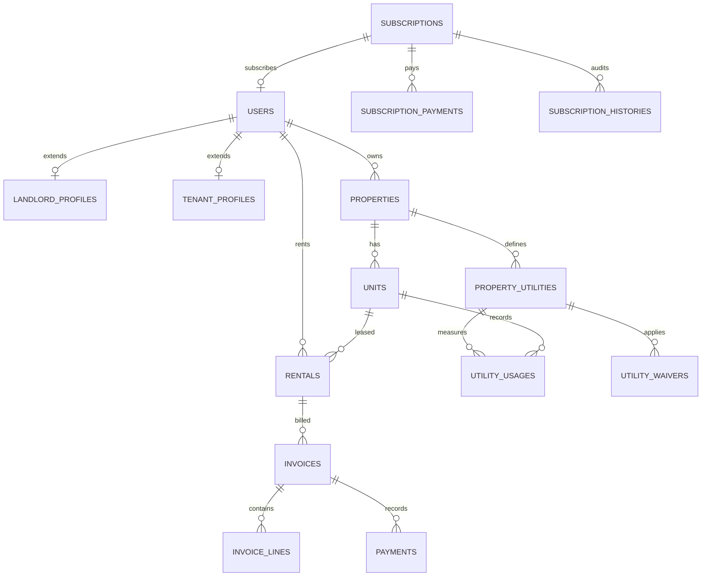

# 💾 Database ER Diagram

RentWise uses a highly normalized database schema. Below is a visual model of how the core tables are linked together.

---

## 🗂️ Core Models Reference
- **[[Backend/Models/User|User]]**: Mapped to `users`.
- **[[Backend/Models/Property|Property]]**: Mapped to `properties`.
- **[[Backend/Models/Unit|Unit]]**: Mapped to `units`.
- **[[Backend/Models/Rental|Rental]]**: Mapped to `rentals`.
- **[[Backend/Models/Invoice|Invoice]]**: Mapped to `invoices`.
- **[[Backend/Models/InvoiceLine|InvoiceLine]]**: Mapped to `invoice_lines`.
- **[[Backend/Models/Payment|Payment]]**: Mapped to `payments`.
- **[[Backend/Models/PropertyUtility|PropertyUtility]]**: Mapped to `property_utilities`.
- **[[Backend/Models/UtilityUsage|UtilityUsage]]**: Mapped to `utility_usages`.
- **[[Backend/Models/UtilityWaiver|UtilityWaiver]]**: Mapped to `utility_waivers`.
