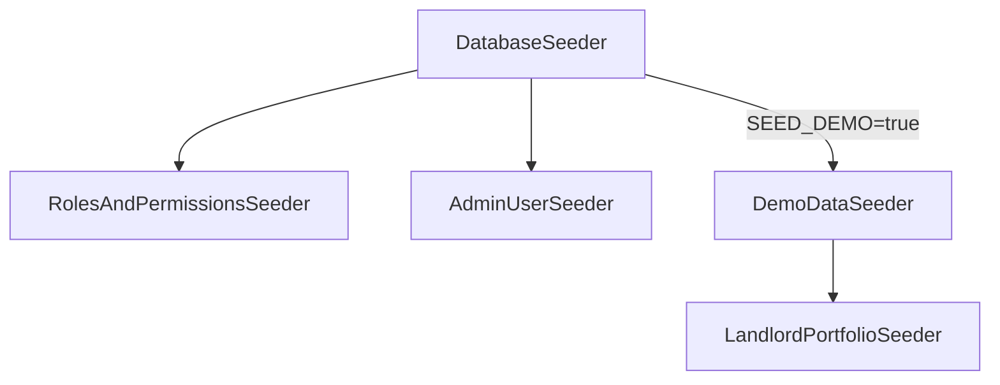

# 💾 Seeders Map

RentWise seeders initialize roles, permissions, administrative profiles, and dummy test portfolios.

---

## 🔀 Seeder Execution Flow

When running `php artisan db:seed`, the system calls [[Database/Seeders|DatabaseSeeder]], executing seeders in this order:

---

## 🗂️ Seeder Details

### 1. RolesAndPermissionsSeeder
- **Purpose**: Creates the base role permissions mapping using Spatie permissions and Filament Shield parameters.
- **Roles Created**:
  - `super_admin`: Full permissions across the application.
  - `support`: Read-only access across properties; limited write rights for user accounts.
  - `landlord`: Full control (CRUD) over properties, units, utilities, billing, and rentals.
  - `landlord_manager`: Read/write delegated rights without deletion access.
  - `tenant`: No back-office access. Restricted to portal operations.

### 2. AdminUserSeeder
- **Purpose**: Mints default platform administrators:
  - `admin@rentwise.test` (Role: `super_admin`, Password: `password`).
  - `support@rentwise.test` (Role: `support`, Password: `password`).

### 3. LandlordPortfolioSeeder
- **Purpose**: Generates dummy property groups, units, and sequential tenancy chains to simulate real-world usage during development.
- **Attributes**:
  - Sets up mock water/electricity readings.
  - Links rooms to randomized tenant profiles.

### 4. DemoDataSeeder
- **Purpose**: High-level orchestrator. Creates a dummy `landlord@rentwise.test` profile, configures a basic subscription, creates properties/units, and maps a demo tenant (`tenant@rentwise.test`).
